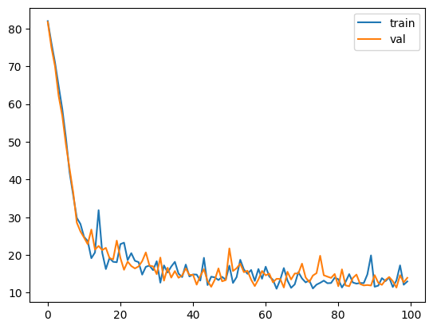

# へっぽこAIをつくろう！(NLP/ML 勉強会ノート)

Huling では「Huling 技術会」と称して、言語に関する技術的な活動・勉強会を行っています。昨年夏には「第2回 自然言語処理(NLP)/機械学習(ML) 勉強会」を開催し、生成AIの仕組みに関する知識の共有を行いました。この記事は、北大IT研究会(HUIT)において同じ内容の勉強会を実施した際に作成した勉強会ノートです。テーマは「とにかくそれっぽく動く言語モデルを作る」です。内容に不正確・不明瞭なところもあると思いますが、これを読んで情報会の活動に興味を持っていただけたら嬉しいです。

下の[左の二次元コード](https://speakerdeck.com/xiupos/ml-mian-qiang-hui-at-huit)は勉強会で使用した発表スライドです。当ノートと併せて読むことを強く推奨します。また、[右の二次元コード](https://colab.research.google.com/gist/xiupos/f14c3250f306c79cd14ad9e7ce85f36a/nlp-ml-huit.ipynb)から、当記事と同じ内容のコードを Google Colab で実際に動かすことができます。

<div style="display: flex; justify-content: center; gap: 5em;">

<div>

{width=130}

</div>

<div>

{width=130}

</div>

</div>


---

とにかく動く言語モデルを作ります。動けばいいので、精度は求めません。単純な構成を採用して「それっぽく」動くものをまずは作ってみましょう。

[発表スライド](https://speakerdeck.com/xiupos/ml-mian-qiang-hui-at-huit)を前提とした記述をしています。

## 準備

まずは使うライブラリを用意します。今回は [PyTorch](https://pytorch.org/) を中心に使います。


```python
import torch
from torch import nn
from torch.nn import functional as F
import numpy as np
from matplotlib import pyplot as plt
import pandas as pd
# 乱数を固定
torch.manual_seed(1)
```

次に教師データを用意します。教師データは何でもいいですが、ここでは「シャーロックホームズの冒険 (The Adventures of Sherlock Holmes)」の[原文](https://sherlock-holm.es/stories/plain-text/advs.txt)にしました。有名な教師データには [Tiny Shakespeare](https://raw.githubusercontent.com/karpathy/char-rnn/master/data/tinyshakespeare/input.txt) などがあります。


```python
# 教師データをダウンロード (https://sherlock-holm.es/stories/plain-text/advs.txt を基に作成)
!wget https://gist.githubusercontent.com/xiupos/b7914ea1e3ab35465c34de45146b15d8/raw/b7623310de06160876ffba6299994b0409c85c81/advs.txt
lines: str = open('./advs.txt', 'r').read().replace('\n', ' ')
```

教師データは文字列です。文字列を機械学習で直接扱うのは難しいので、まずは単語を整数と対応させます。ただし、英単語を単位に扱うのは高度なので、簡単のためここでは文字を単位に考えます。以降、「単語」は文字のことを指します。言語モデルの文脈では「トークン」と呼ぶのが正確だと思います。

単純に文字順の番号を文字と対応する整数として用います。たとえば、文字順で $μ$ 番目の文字には整数 $μ$ が対応します。以降、その文字のことを単語 $μ$ と呼びます。


```python
# 文字一覧
vocab: list[str] = sorted(list(set(lines)))
# {整数(番号): 文字} の辞書
itos: dict[int, str] = {i:s for i,s in enumerate(vocab)}
# {文字: 整数(番号)} の辞書
stoi: dict[str, int] = {s:i for i,s in enumerate(vocab)}

# 文字の一覧と数
"".join(vocab), len(vocab)
```

**実行結果:** `(' !"&\'(),-./0123456789:;?ABCDEFGHIJKLMNOPQRSTUVWYZ[]abcdefghijklmnopqrstuvwxyz£½àâèé', 83)`


次に上の対応を用いて、文字列を整数列に変換する関数を定義しましょう。また教師データを整数列に変換して教師データ `dataset` とします。


```python
# エンコード (文字列 -> 数リスト の関数)
def encode(s: str) -> list[int]:
    return [stoi[s] for s in s]

# デコード (数リスト -> 文字列 の関数)
def decode(l: list[int]) -> str:
    return ''.join([itos[i] for i in l])

# 教師データを整数列に変換
dataset = encode(lines)

# エンコードとデコードのテスト
encode("Do you know, Watson,"), decode(encode("Do you know, Watson,"))
```

**実行結果:** `([27, 65, 0, 75, 65, 71, 0, 61, 64, 65, 73, 7, 0, 46, 51, 70, 69, 65, 64, 7], 'Do you know, Watson,')`

以降の便利のため、`dataset` から学習用のバッチを作成する関数を定義します。例えば "Do you know, Watson," という文章に対し, バッチは以下の2つの文字列の組から構成されます。

- x: `Do you know, Wat`
- y: `o you know, Wats`

後述しますが、今回は「1単語から次の1単語を予測する」モデルを作ります。そのため、パッチは1文字ずらしたタプルになっています。


```python
# バッチを作成する関数
# 幅 xnum で1文字ずれた列を生成する
# ex) ['rip has been upo', 'ip has been upon']
#      |<-----xnum----->|  |<-----xnum----->|
def get_batches(xnum: int, data: list[int] = dataset, split="train") -> tuple[list[int], list[int]]:
    # 教師データを 8:2 で分割してバッチとする
    if split == "train":
        # 学習データ
        batchdata = data[:int(len(data)*0.8)]
    else:
        # 検証データ
        batchdata = data[int(len(data)*0.8):]

    # パッチの開始位置をランダムに決める
    idx = torch.randint(0, len(batchdata)-xnum-1, (1,))
    # パッチを取り出す
    x = batchdata[idx:idx+xnum]
    y = batchdata[idx+1:idx+xnum+1]
    return x, y

# バッチのテスト
[decode(l) for l in get_batches(16)]
```

**実行結果:** `['rip has been upo', 'ip has been upon']`


これで準備が整いました。

## はじめてのモデル

さて、はじめてのモデルを作っていきます。ここでは「1単語から次の1単語を予測する」モデルを作ります。これを繰り返し行うことで文章を生成することができます。

まずは単語のベクトル化の関数を定義しましょう。詳細は発表スライドを参照してください。


```python
# 数リスト -> 文字ベクトル の関数
def ltov(l: list[int]) -> torch.Tensor:
    # ワンホットベクトルに変換
    return torch.eye(len(vocab))[l]

# logits -> 数リスト の関数 (確率分布に基づく)
def vtol(v: torch.Tensor) -> list[int]:
    # 確率分布を計算
    p = F.softmax(v, dim=-1)
    # 確率分布を基に
    return torch.multinomial(p, num_samples=1).view(-1).tolist()

# logits -> 数リスト の関数 (貪欲法)
def vtol_greedy(v: torch.Tensor) -> list[int]:
    # 値が最大(⇔確率が最大)の文字を選択
    return torch.argmax(v, dim=-1).tolist()

# 試しに文字ベクトルを logits として文字に戻す
xs, _ = get_batches(16)
logits = ltov(xs)
decode(xs), decode(vtol(logits)), decode(vtol_greedy(logits))
```

**実行結果:** `('bited. The bedro', '½Qz,eKvHs0:6SdLQ', 'bited. The bedro')`


次にモデルの中心となるニューラルネットワークを定義します。簡単のため ReLU を活性化関数に用いた中間層1層の順伝播型ニューラルネットワークとします: 式に書くと
$$
\vec{y} = W_2 \operatorname*{ReLU}(W_1 \vec{x} + \vec{b}_1) + \vec{b}_2
$$
です。ここで、行列 $W_1$, $W_2$ とベクトル $\vec{b}_1$, $\vec{b}_2$ はモデルのパラメータです。成分表示すれば,
$$
\begin{aligned}
y_μ
  &= \sum_ν \left[ w_{2μν} \operatorname*{ReLU}\left(\sum_λ w_{1νλ} x_λ + b_{1λ}\right) + b_{2ν} \right] \\
  &= \sum_ν \left[ w_{2μν} \max\left(\sum_λ w_{1νλ} x_λ + b_{1λ}, 0\right) + b_{2ν} \right]
\end{aligned}
$$
となります。
PyTorch の `nn.Sequential` を使ってモデルを定義しましょう。 `nn.Linear` は $\vec{x} ↦ W \vec{x} + \vec{b}$, `nn.ReLU` は $\vec{x} ↦ \operatorname*{ReLU}(\vec{x})$ を意味しています。


```python
# モデルの隠れ層の要素数
d_model = 128

# モデルの定義
model = nn.Sequential(
    nn.Linear(len(vocab), d_model),
    nn.ReLU(),
    nn.Linear(d_model, len(vocab)),
)

# モデルのパラメータのサイズ
model, [m.numel() for m in model.parameters()]
```

**実行結果:**


    (Sequential(
       (0): Linear(in_features=83, out_features=128, bias=True)
       (1): ReLU()
       (2): Linear(in_features=128, out_features=83, bias=True)
     ),
     [10624, 128, 10624, 83])


ここで、隠れ層の要素数は `hidden_layer_dim` としました。さっそくモデルを使ってみましょう。適当にバッチを取得して次の単語を予想させてみます。


```python
# モデルのテスト
xs, _ = get_batches(16)
logits = model(ltov(xs))
decode(xs), decode(vtol(logits)), decode(vtol_greedy(logits))
```

**実行結果:** `('ression upon me,', "uTCf'G)zewtKLHr!", 'Vlgggg(gMgg(ggll')`


滅茶苦茶ですね。学習も何もしてないので当然の結果です。ついでに長い文章を生成する関数も定義します。


```python
# 文章を生成する関数
def generate(model: nn.Module, xnum=100) -> str:
    # 文章(数リスト)を格納する配列
    out: list[int] = []
    # 初期状態(1文字目をランダムに選択)
    out += torch.randint(0, len(vocab), (1,)).tolist()

    # 文章の長さだけ繰り返し
    for i in range(xnum):
        # 結果の最後の文字に対しモデルを適用
        ys = vtol(model(ltov(out[-1:])))
        # 結果に追加
        out += [ys[-1]]

    return decode(out)

# 文章を生成してみる
print(generate(model))
```

**実行結果:**

> W6)TfOcQKfélo7h]è(0o?eNSRB7U1vh½m;"l)£JHB9!h£s&Kgm7TfhDy58b:?2m5B'n" fS£gW[-VeFPK3P9:léiVEVLQtC?V7Geo


見るからに出鱈目です。ですが、どのくらい出鱈目でしょうか？モデルを学習させるためにはこの「出鱈目さ」を計算する必要があります。

## モデルの評価

作ったモデルを定量的に評価することを考えます。機械学習においては「損失関数」と呼ばれる関数を用いて、教師データとモデルのずれを評価します。ここでは「交差エントロピー」という関数を使います。詳細は発表スライドを参照してください。


```python
# 損失関数に交差エントロピーを採用する
loss_fn = nn.CrossEntropyLoss()

# バッチに対して損失関数を計算してみる
xs, ys = get_batches(16)
loss = loss_fn(model(ltov(xs)), ltov(ys))
loss.item()
```

**実行結果:** `4.4361042976379395`


この値はどう解釈すればいいのでしょうか? 今回の教師データ $\vec{y}$ はワンホットベクトルで, ここでは $\vec{y}$ が単語 $μ$ を表しているときの確率分布が $p = \{p_ν\} = \{δ_{μν}\}$ としてみましょう。(実際、`nn.CrossEntropyLoss()` ではこのような扱いになります。) このとき1単語のみの損失関数は
$$
\begin{aligned}
\mathtt{loss}
  &= ⟨- \log q⟩ \\
  &= - \sum_ν p_ν \log q_ν \\
  &= - \sum_ν δ_{μν} \log q_ν \\
  &= - \log q_μ \\
\end{aligned}
$$
であるので、損失関数の値 `loss` から単語 $μ$ の生成確率がわかります:
$$
q_μ = e^{-\mathtt{loss}}
$$
実際には損失関数は複数の単語についての平均値になるので、正しい単語の生成確率が
$$
q = e^{-\mathtt{loss}}
$$
になるくらいの目安です。


```python
# 単語の生成確率
q = torch.exp(-loss)
q.item()
```

**実行結果:** `0.011841981671750546`


これでもまだよくわかりませんね。ところで、$N$ 個の単語から無作為に単語を選ぶとき、正しい単語が選ばれる確率は $\displaystyle q = \frac1N$ となります。つまり, $1/q\ (=e^{\mathtt{loss}})$ は無作為に単語を選び出したとするときの「母数」を表しています。これを計算してみましょう。


```python
# 単語生成の"母数"
1/q.item(), len(vocab)
```

**実行結果:** `(84.44532576718426, 83)`


つまり $1/q≃\mathtt{len(vocab)}$ であることがわかりました。モデルはほとんど無作為に単語を選んでいるということです。学習も何もしていないので当然の結果ですね。それではこれを改善すべく、モデルを学習させていきましょう。

## モデルの学習

モデルの学習をします。学習とは損失関数の値が小さくなるようパラメータの値を変えていく作業です。詳細は発表スライドを参照してください。ここでは Adam ([arXiv:1412.6980](https://arxiv.org/abs/1412.6980)) という確率的勾配降下法の改良を利用して学習を実行します。


```python
# 学習 (最適化手法に Adam を採用する)
def train(model: nn.Module, optim=torch.optim.Adam, epochs=100):
    # optimizer を初期化
    optimizer = optim(model.parameters())
    # 学習過程を記録する配列
    logs: dict[str, list[float]] = {"train": [], "val": []}

    # epochs の回数だけ学習を繰り返す
    for epoch in range(epochs):
        # 一時的に学習過程を記録する配列(後で平均を取って log に加える)
        log_temp: dict[str, list[float]] = {"train": [], "val": []}

        # 学習と検証を10回ずつ実行
        for _ in range(10):
            for split in ["train", "val"]:
                if split == "train":
                    # 学習用
                    model.train()
                else:
                    # 検証用
                    model.eval()

                # バッチを取得
                xs, ys = get_batches(16, split=split)
                # 損失関数を計算
                loss = loss_fn(model(ltov(xs)), torch.tensor(ys))
                # 「母数」の値を記録
                log_temp[split] += [torch.exp(loss).item()]

                # 学習を実行
                if split == "train":
                    # 勾配を初期化
                    optimizer.zero_grad()
                    # 誤差逆伝播
                    loss.backward()
                    # 学習
                    optimizer.step()

        # 10回の学習・検証の値を平均して記録
        for split in ["train", "val"]:
          logs[split] += [float(np.mean(log_temp[split]))]

    # 学習過程のグラフを返す
    return pd.DataFrame(logs).plot()

# 学習を実行
train(model)
```



上記のグラフの縦軸は前述の「無作為に単語を選び出したとするときの『母数』」で、横軸は `epoch` 数です。学習が繰り返されるごとに「母数」は減っていき、最終的に15語程度になっていることがわかります。これはすごい進化です！もはや無作為な単語の羅列では無いはずです。さっそく文章を生成してみましょう。


```python
print(generate(model))
```

**実行結果:**

> pdN.apine t ul. Md my itie, Mrd, Tgooncaad  he weny t syurthes a BW. "ucofe, mounl, ot b cpan stohiva


学習前は出鱈目な羅列だったのが、学習によって「薄目で見れば英語かもしれない」程度の文章を生成するようになりました。現実に存在する単語もいくつかあります。当初の目標だった、「それっぽく」動く言語モデルの完成です。

## 参考文献

理論は以下を参考にしました:

- 岡﨑 直観, 荒瀬 由紀, 鈴木 潤, 鶴岡 慶雅, 宮尾 祐介.『IT Text 自然言語処理の基礎』(オーム社, 2022)

実装は以下を参考にしました:

- "Llama from scratch (or how to implement a paper without crying) | Brian Kitano" URL:https://blog.briankitano.com/llama-from-scratch/
- "CrossEntropyLoss — PyTorch 2.3 documentation" URL:https://pytorch.org/docs/stable/generated/torch.nn.CrossEntropyLoss.html

<p style="text-align: right;">
(理学部B4 xiupos)
</p>
