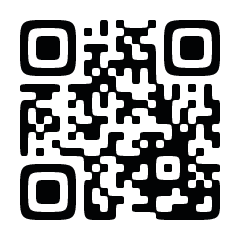

  # 北大言語学サークル 第三外国語文法概説・寄稿

<nav id="toc" role="doc-toc">

  ## 目次

  1. [はじめに](preface.html)
  1. [第三外国語文法概説](3gai/index.html)
      1. [古教会スラブ語](3gai/chu.html)
      1. [アイヌ語](3gai/ain.html)
      1. [アラビア語](3gai/ara.html)
      1. [フィンランド語](3gai/fin.html)
      1. [ポーランド語](3gai/pol.html)
      1. [トルコ語](3gai/tur.html)
  1. [寄稿](contri/index.html)
      1. [法律と言語学 ～日本国憲法は、これを言語学的に検討する～](contri/consti.html)
      1. [知っていますか?「日本語教育」](contri/edu_jpn.html)
      1. [「きのうてきなんしいん」ってなぁに？](contri/pol_spolgloski_miekki.html)
      1. [ロシア国内でのフランス語](contri/fra_rus.html)

</nav>

  <h2>公式サイト</h2>
  <a href="https://huling.org/">
    
    <h2 style="color: black; margin-top: 0em;">https://huling.org/</h2>
  </a>

